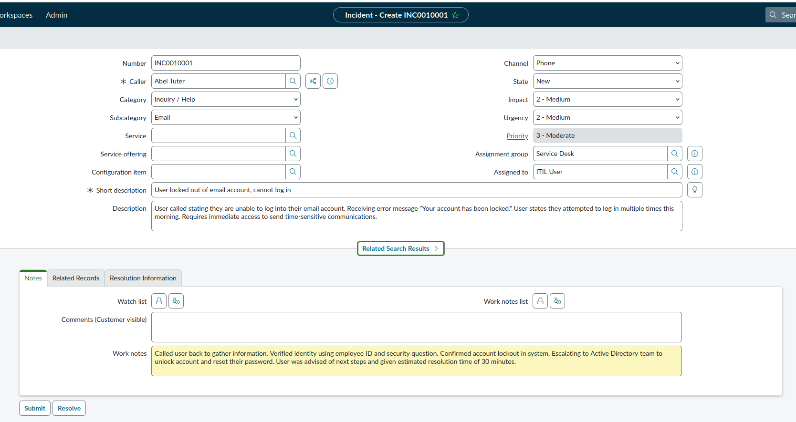
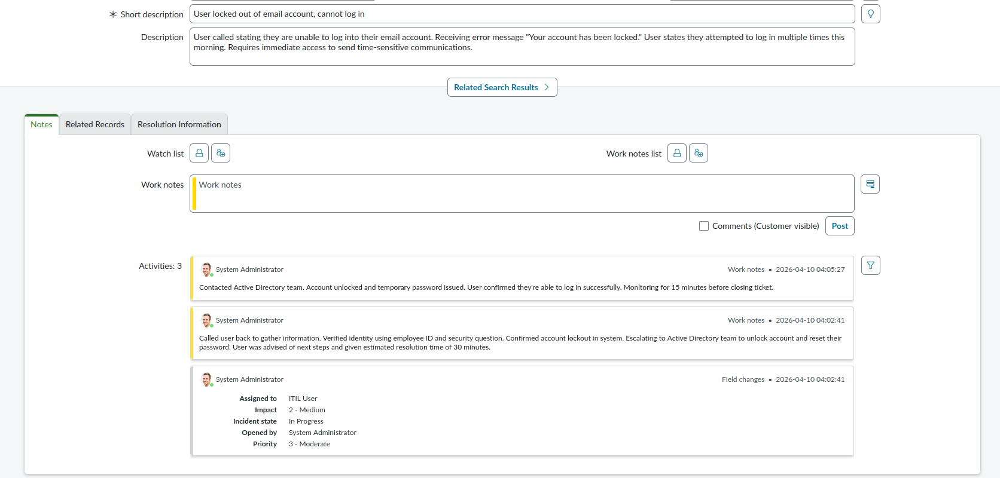
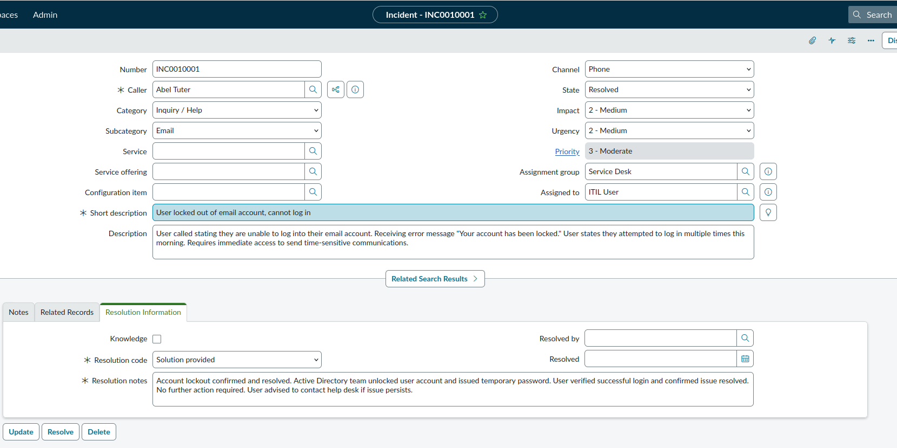
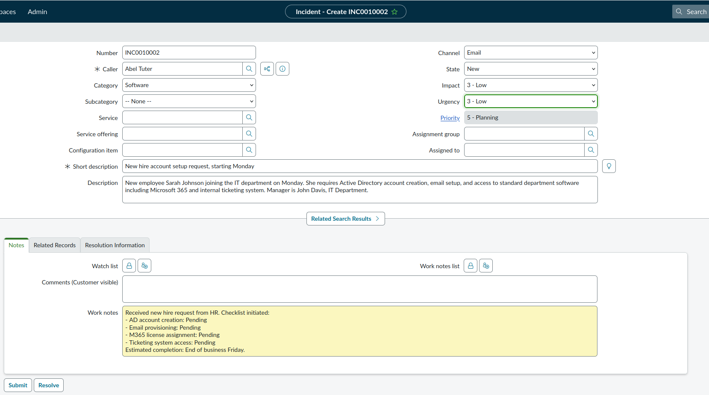
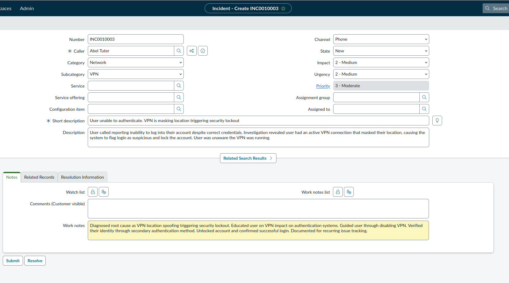
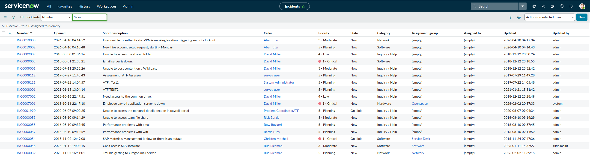
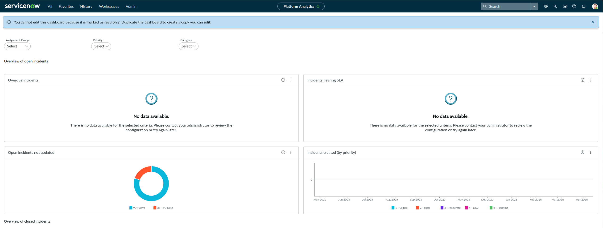

# ServiceNow Ticketing Lab

Hands-on ITSM lab using a ServiceNow Personal Developer 
Instance to simulate real help desk ticket workflows.

## Why I Built This

Ticketing systems appear in nearly every help desk JD. 
Built this lab to demonstrate I can triage, document, 
escalate, and resolve tickets in ServiceNow, an
industry standard ITSM platform.

## What I Built

- Created and managed incidents from open to resolution
- Simulated common help desk scenarios: account lockouts,
  VPN issues, new hire provisioning
- Documented troubleshooting steps and resolution notes
  following ITSM best practices
- Practiced queue management and ticket prioritization

## STAR Breakdown

**Situation:** A user calls unable to log in. The ticket 
queue shows multiple open incidents requiring triage.

**Task:** Create accurate tickets, document troubleshooting 
steps, assign priority, and resolve or escalate within SLA.

**Action:** Created incidents in ServiceNow for password 
reset, VPN lockout, and new hire provisioning scenarios. 
Documented each step including caller info, impact, 
urgency, work notes, and resolution details following 
ITSM best practices.

**Result:** All tickets documented, triaged, and resolved 
with full audit trail. Demonstrated ability to manage a 
ticket queue and follow structured resolution workflows.

## Skills Demonstrated

ServiceNow · ITSM · Ticket Triage · Incident Management · 
Documentation · Escalation Workflows · Help Desk Operations

## Screenshots

### Incident Created

### Incident In Progress

### Incident Resolved

### New Hire Request

### VPN Lockout Ticket

### Ticket Queue

### Incident Dashboard

